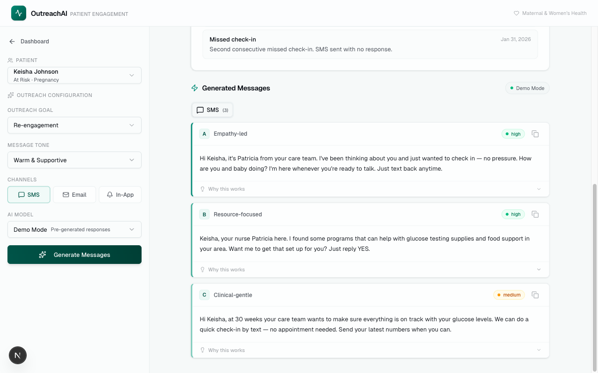
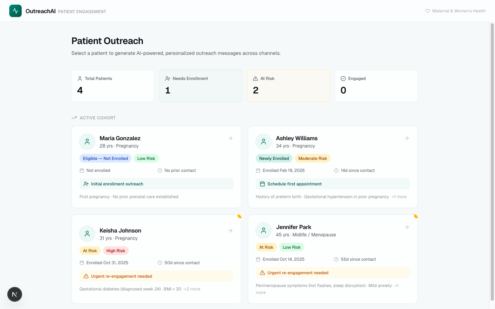

# OutreachAI

AI-powered patient outreach message generator for maternal and women's healthcare. Care coordinators select a patient, configure outreach parameters, and generate personalized messages across SMS, email, and in-app channels — each with multiple variants, engagement predictions, and clinical reasoning.



## Live Demo

**[outreachai.ryancalacsan.dev](https://outreachai.ryancalacsan.dev)**

The app works immediately in Demo Mode with pre-generated responses — no API keys needed.

## Features

- **Patient-aware generation** — 4 realistic patient profiles with clinical context (pregnancy, postpartum, midlife care), risk factors, care team info, and interaction history
- **Multi-channel output** — SMS, email, and in-app messages with channel-appropriate formatting and length
- **A/B/C variant generation** — Each channel produces 3 message variants with different approaches (empathy-led, resource-focused, clinical-gentle, etc.)
- **Engagement scoring** — Each variant includes a predicted engagement likelihood (high/medium/low) with clinical reasoning
- **Smart defaults** — Outreach goal and preferred channel auto-populate based on patient lifecycle stage
- **6 outreach goals** — Enrollment, onboarding, appointment reminders, re-engagement, win-back, educational
- **4 message tones** — Warm/supportive, clinical/informative, urgent/action, casual/friendly
- **Live LLM streaming** — Real-time token streaming with Gemini and Claude, with progress indicators
- **Responsive design** — Desktop sidebar layout with mobile bottom sheet drawer



## Tech Stack

| Layer | Technology |
|-------|-----------|
| Frontend | Next.js 16 (App Router), React 19, TypeScript |
| Backend (Python) | FastAPI, Pydantic, uvicorn |
| Styling | Tailwind CSS v4, shadcn/ui v4 |
| LLM Providers | Google Gemini (2.5 Flash, 2.5 Flash Lite, 3.1 Flash Lite Preview), Anthropic Claude (Sonnet, Haiku) |
| LLM SDKs | `@anthropic-ai/sdk` + `@google/genai` (TypeScript), `anthropic` + `google-genai` (Python) |
| Validation | Zod v4 (TypeScript), Pydantic v2 (Python) — schemas are single source of truth for types, runtime validation, and JSON Schema generation |
| Streaming | Server-Sent Events (SSE) via both Next.js ReadableStream and FastAPI sse-starlette |
| Containerization | Docker, Docker Compose (Next.js only or full-stack with Python) |
| CI | GitHub Actions — TypeScript lint/test/build + Python tests (parallel jobs) |
| Deployment | Vercel (frontend + Next.js API routes) |

## Getting Started

### Demo Mode (no setup needed)

```bash
npm install
npm run dev
```

Open [http://localhost:3000](http://localhost:3000). Select **Demo Mode** to explore the full app with pre-generated responses.

### Live AI Mode (Next.js backend)

Create a `.env.local` file:

```env
GEMINI_API_KEY=your_gemini_api_key
ANTHROPIC_API_KEY=your_anthropic_api_key
DEMO_ACCESS_CODE=your_access_code
```

```bash
npm run dev
```

Select a live AI model in the sidebar and enter the access code to generate. LLM calls are handled by the Next.js API route.

### Live AI Mode (Python backend)

Run both services in separate terminals:

```bash
# Terminal 1 — FastAPI
cd backend
uv sync
uv run uvicorn app.main:app --reload --port 8000

# Terminal 2 — Next.js (pointed at Python backend)
NEXT_PUBLIC_BACKEND_URL=http://localhost:8000 npm run dev
```

LLM calls now route through the FastAPI backend. The Python service uses the same `.env.local` file for API keys.

### Docker Compose

**Next.js only** (uses built-in API route):

```bash
docker compose up --build
```

**Next.js + Python backend** (frontend proxies LLM calls to FastAPI):

```bash
docker compose -f docker-compose.python.yml up --build
```

Both modes serve the app at [http://localhost:3000](http://localhost:3000). The Python variant also exposes [http://localhost:8000/docs](http://localhost:8000/docs) for the FastAPI Swagger UI.

## Architecture

The app has two independent backend implementations — a Next.js API route (TypeScript) and a FastAPI service (Python) — both providing the same `/api/generate` endpoint with identical behavior. The frontend can be pointed at either one.

```
┌─────────────────────────────────────────────────────────┐
│                    Next.js Frontend                     │
│              (React 19, Tailwind, shadcn)               │
└──────────────┬──────────────────────┬───────────────────┘
               │                      │
     Default (Vercel)         NEXT_PUBLIC_BACKEND_URL
               │                      │
               ▼                      ▼
  ┌────────────────────┐   ┌─────────────────────┐
  │  Next.js API Route │   │   FastAPI (Python)   │
  │    (TypeScript)    │   │  Pydantic, uvicorn   │
  └────────┬───────────┘   └──────────┬──────────┘
           │                          │
           ▼                          ▼
  ┌────────────────────────────────────────────┐
  │        LLM APIs (Claude + Gemini)          │
  └────────────────────────────────────────────┘
```

### Next.js (Frontend + TypeScript Backend)

```
src/
  app/
    api/generate/          # POST endpoint — routes to mock or live LLM
    page.tsx               # Main layout (campaign dashboard + generation view)
    globals.css            # Theme, animations, custom properties
  components/
    campaign-view.tsx      # Dashboard with patient overview and stats
    patient-card.tsx       # Patient context display (compact + full)
    patient-select.tsx     # Patient dropdown with lifecycle/program tags
    outreach-controls.tsx  # Configuration panel (goal, tone, channels, model)
    message-output.tsx     # Generated message variants with tabs
    mobile-controls-drawer.tsx  # Bottom sheet for mobile
    layout/header.tsx      # App header
    ui/                    # shadcn/ui primitives
  lib/
    data/
      patients.ts          # 4 patient profiles with clinical context
      mock-responses.ts    # Pre-generated demo responses
    llm/
      index.ts             # Provider factory + response validation
      gemini.ts            # Google Gemini integration
      gemini-stream.ts     # Gemini SSE streaming
      claude.ts            # Anthropic Claude integration
      claude-stream.ts     # Claude SSE streaming
    prompts/
      outreach.ts          # Dynamic system + user prompt construction
    schemas.ts             # Zod schemas — single source of truth for types, validation, and JSON Schema
    types.ts               # Re-exports types from schemas.ts
    env.ts                 # Validated environment variable access (via serverEnvSchema)
    api.ts                 # Client-side fetch + SSE stream parser (with Zod-validated events)
    utils/format.ts        # Label maps, date formatting
```

### FastAPI (Python Backend)

```
backend/
  pyproject.toml             # Dependencies (FastAPI, Pydantic, anthropic, google-genai)
  app/
    main.py                  # FastAPI app, CORS, health check
    config.py                # Settings via pydantic-settings (env vars)
    models.py                # Pydantic models (mirrors types.ts)
    prompts.py               # System + user prompt builders (mirrors outreach.ts)
    data/
      patients.py            # Same 4 patient profiles
    routers/
      generate.py            # POST /api/generate — validation, rate limiting, SSE streaming
    llm/
      __init__.py            # Provider dispatch (Claude/Gemini routing)
      claude.py              # AsyncAnthropic: generate + stream
      gemini.py              # Google GenAI async: generate + stream
  tests/
    test_models.py           # Pydantic model validation (19 tests)
    test_prompts.py          # Prompt builder output verification (17 tests)
    test_patients.py         # Patient data integrity (8 tests)
    test_endpoint.py         # API endpoint behavior (9 tests)
```

## Design Decisions

- **Dynamic prompts** — System prompts only include rules for selected channels, reducing token usage and improving compliance
- **Server-side filtering** — Channel filtering on the response as a safety net for LLM non-compliance
- **Schema-driven validation** — Zod schemas (TypeScript) and Pydantic models (Python) are the single source of truth for types, API validation, LLM response validation, and JSON Schema generation for structured output
- **Rate limiting** — In-memory rate limiting (10 req/hr per IP) with periodic cleanup for live mode
- **Access code gating** — Live LLM endpoints require an access code to prevent unauthorized API usage
- **Mock-first** — Demo mode is the default, so the app is fully functional without any API keys
- **Smart fallback** — Mock mode tries exact match, then goal-match, then tone-match, then any patient scenario before falling back to generic responses
- **Input validation** — API route validates request body with Zod `safeParse` (TypeScript) and Pydantic model binding (Python), with specific error messages for each field
- **Environment validation** — Server env vars are validated at first use via Zod schema, failing fast with clear messages instead of cryptic runtime errors

## Running Tests

### Python backend

```bash
cd backend
uv sync
uv run pytest tests/ -v
```

56 tests covering models, prompts, patient data, and API endpoint behavior.

### Frontend

```bash
npm test        # 135 tests (Vitest)
npm run lint    # ESLint
```

CI runs TypeScript lint/test/build and Python tests in parallel on every push to `main` and PR via GitHub Actions.

## What I'd Build Next

- **Spanish language support** — Maria's profile is already set up for bilingual outreach; extend prompts and UI for language selection
- **A/B test tracking** — Record which variant a coordinator selects and track engagement outcomes over time
- **Analytics dashboard** — Visualize outreach volume, channel performance, and engagement rates across the patient population
- **EHR integration** — Pull real patient context from Epic/Cerner FHIR APIs instead of static profiles
- **Care team collaboration** — Allow nurses to edit, approve, and schedule generated messages directly
- **Compliance review workflow** — Flag messages for clinical review before sending, with audit trail
- **Batch generation** — Generate outreach for an entire patient cohort at once with campaign-level controls
